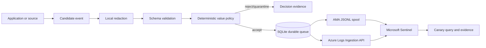

# Bower

> Bower helps security teams collect meaningful security events from custom
> applications and legacy products that do not integrate cleanly with Microsoft
> Sentinel.
>
> Inspired by the Australian bowerbird, Bower deliberately selects and arranges
> valuable security signals rather than forwarding every available log.
>
> It filters low-value noise, validates and redacts records, reliably buffers
> events, and delivers them through Azure Monitor Agent-compatible files or the
> Azure Monitor Logs Ingestion API.
>
> Developers can use the Bower SDK and generated AGENTS.md instructions to
> instrument security-relevant actions consistently without needing to understand
> Sentinel ingestion internals.

**Turn scattered application noise into trusted security signal.**

Bower follows **Collect → Select → Arrange → Deliver → Prove**. It is a
self-hosted security telemetry bridge, not a generic log shipper, APM platform,
SIEM, or replacement for Azure Monitor Agent.

> [!WARNING]
> Bower cannot make inaccurate application events trustworthy. Applications must
> emit semantic events at authoritative points in their workflows. Never send
> passwords, credentials, tokens, cookies, unrestricted bodies, or file contents.

## Project status

**Pre-alpha foundation. Not production-ready.** Current code implements typed
contracts, bounded SDK buffering, local HTTP collection, pre-persistence
redaction, deterministic default-deny policy evaluation, SQLite WAL queue and
deduplication, retry/dead-letter transitions, AMA spool output, real Azure Monitor
Logs Ingestion SDK output, Entra-protected fleet management and approval UI,
basic CLI tooling, schemas and deployment examples.

Source adapters, complete catalogue commands, Roslyn packages, Azure plan/apply,
query-backed evidence bundles, signing and broad resilience testing remain before
v1. No mocked upload is represented as Sentinel delivery.

## Architecture



Full design: [architecture](docs/architecture/overview.md).

## Supported foundation

| Capability | Status |
|---|---|
| .NET runtime | .NET 10 LTS |
| Windows | `win-x64`, `win-arm64` publishing configured by release workflow |
| Linux | `linux-x64`, `linux-arm64` publishing configured by release workflow |
| Local collector HTTP | Implemented; loopback default |
| Durable SQLite queue | Implemented |
| AMA companion spool | Implemented |
| Logs Ingestion API | Real Azure SDK client implemented; tenant test required |
| Docker, systemd, Kubernetes | Baseline deployment assets |
| Management UI and API | Fleet inventory, approval, health, audit and Entra app-role RBAC implemented |
| Windows Service self-install | Not implemented |
| File, SQL, REST, Event Log sources | Not implemented |
| Sentinel query proof/evidence bundle | Not implemented |

## Quick start

Requires .NET 10 SDK.

```bash
dotnet restore
dotnet build --configuration Release
dotnet test --configuration Release

BOWER_QUEUE_PATH=./artifacts/bower.db \
BOWER_POLICY_DIRECTORY=./policies/default \
BOWER_OUTPUT=ama-spool \
BOWER_AMA_SPOOL_PATH=./artifacts/spool \
dotnet run --project src/Bower.Collector
```

In another shell:

```bash
dotnet run --project src/Bower.Cli -- test emit
dotnet run --project src/Bower.Cli -- queue inspect \
  --database ./artifacts/bower.db
```

Canary output proves local receipt, policy acceptance and queue/output state only.
It does not prove Sentinel queryability.

## Management UI

Bower includes a self-hosted React management console and ASP.NET Core API for:

- deployed collector and machine inventory;
- source coverage, queue pressure and output health;
- pending → approved → active → suspended/revoked collector lifecycle;
- reasoned enrollment approval;
- management audit history;
- Microsoft Entra ID SSO and app-role RBAC.


<table>
  <tr>
    <td width="72%">
      
    </td>
    <td width="28%">
      
    </td>
  </tr>
  <tr>
    <td><sub>Reasoned collector approval and immutable decision history.</sub></td>
    <td><sub>Responsive fleet navigation.</sub></td>
  </tr>
</table>

Screenshots use synthetic fleet metadata from the loopback-only development
preview. The production deployment requires Entra ID authentication.

Entra security groups are assigned to Bower app roles. Group members receive the
role in their access token, avoiding direct dependence on large or overage-prone
group claims. The interactive roles are `Bower.Viewer`, `Bower.Operator`,
`Bower.Approver` and `Bower.Administrator`; collector service principals receive
the separate `Bower.Collector` role.

```bash
# Explicit local-only development mode.
ASPNETCORE_ENVIRONMENT=Development \
BOWER_AUTH_MODE=development \
BOWER_MANAGEMENT_DB_PATH=./artifacts/management.db \
dotnet run --project src/Bower.Management.Api

cd ui/Bower.Management.Web
cp .env.example .env.local
# Set VITE_BOWER_AUTH_MODE=development only for local development.
npm ci
npm run dev

# Against a running management deployment:
BOWER_UI_BASE_URL=http://127.0.0.1:4320 npm run test:e2e
BOWER_UI_BASE_URL=http://127.0.0.1:4320 npm run screenshots
```

Production Entra setup and collector identity flow:
[management identity and RBAC](docs/security/management-identity-and-rbac.md).
The UI shell is original Bower code informed by the MIT-licensed
[Shadcn Dashboard](https://github.com/shadcndashboard/shadcndashboard) layout
patterns.

## Developer SDK

```csharp
builder.Services.AddBower(options =>
{
    options.Application.Name = "CustomerPortal";
    options.Application.Environment = builder.Environment.EnvironmentName;
    options.Application.Instance = Environment.MachineName;
    options.LocalCollector.Endpoint = "http://127.0.0.1:4319";
    options.FailApplicationOnTelemetryFailure = false;
});

await bower.AuthenticationFailedAsync(
    new AuthenticationFailedEvent
    {
        Username = request.Username,
        SourceIpAddress = httpContext.Connection.RemoteIpAddress,
        FailureReason = "InvalidPassword",
        CorrelationId = httpContext.TraceIdentifier
    },
    cancellationToken);
```

SDK enqueues into bounded memory and sends asynchronously. Default behavior is
fail-open for business work. Buffer overflow returns a structured failure.

Initialize guidance in another .NET repository:

```bash
bower developer init --path ./CustomerPortal
```

Existing `AGENTS.md` content is preserved; Bower owns only marked section.

## Policy

Policies are versioned YAML, hashed after parsing and cannot execute code:

```yaml
apiVersion: bower.security/v1
kind: TelemetryPolicy
metadata:
  id: BWR-POL-AUTH-FAILURE
  name: Authentication failures
  version: 1.0.0
  owner: Security Operations
match:
  eventCategories: [authentication]
  eventTypes: [authentication_failure]
requirements:
  requiredFields: [timeGenerated, eventType, eventResult, application.name]
  atLeastOne: [actor.userId, actor.username]
decision:
  action: accept
  minimumValueScore: 70
  neverSample: true
```

Unknown events are rejected. Missing required investigation context is
quarantined. Policy response includes ID, version, hash, score and reasons.

## Outputs

AMA companion mode writes one UTF-8 JSON object per line through an active
temporary file and atomic rename into a ready directory. Configure AMA and its
DCR to watch only ready files. Bower does not modify AMA.

Direct mode uses `Azure.Monitor.Ingestion.LogsIngestionClient` with
`DefaultAzureCredential`; managed/workload identity is preferred. Set:

```text
BOWER_OUTPUT=azure-logs-ingestion
BOWER_DCE_ENDPOINT=https://<dce>.<region>.ingest.monitor.azure.com
BOWER_DCR_ID=dcr-<immutable-id>
BOWER_STREAM_NAME=Custom-BowerSecurity
```

Azure upload acknowledgement still needs a Log Analytics query before evidence
can claim end-to-end delivery.

## Legacy SQL direction

Planned SQL adapter will require parameterized, bounded, read-only queries with
stable ordering and durable incrementing/timestamp/composite cursors. Queries
without cursor, row limit or stable ordering will fail validation. No SQL adapter
is shipped yet.

## Evidence

Current local records capture policy hash, configuration identity, queue state and
destination acknowledgement. v1 evidence bundles will add canary generation,
Log Analytics query result, required-field verification and latency. Simulated
and inaccessible evidence will never pass.

## Contributing

Read [CONTRIBUTING.md](CONTRIBUTING.md), root `AGENTS.md`, nearest scoped
instructions and [security policy](SECURITY.md). All first-party warnings are
errors. New behavior needs tests and honest documentation.
