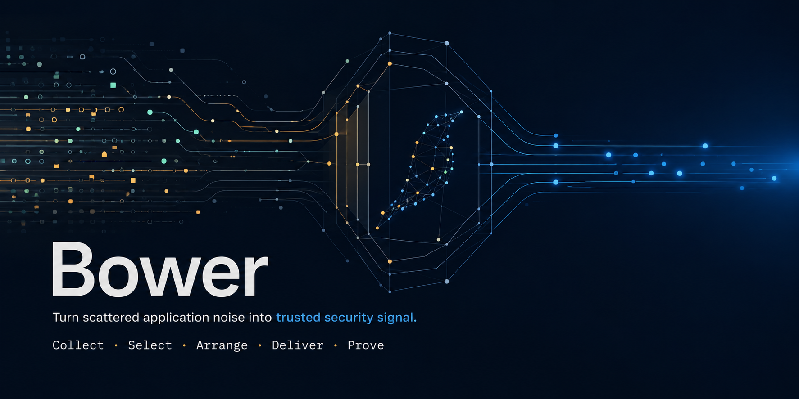
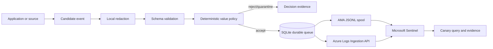
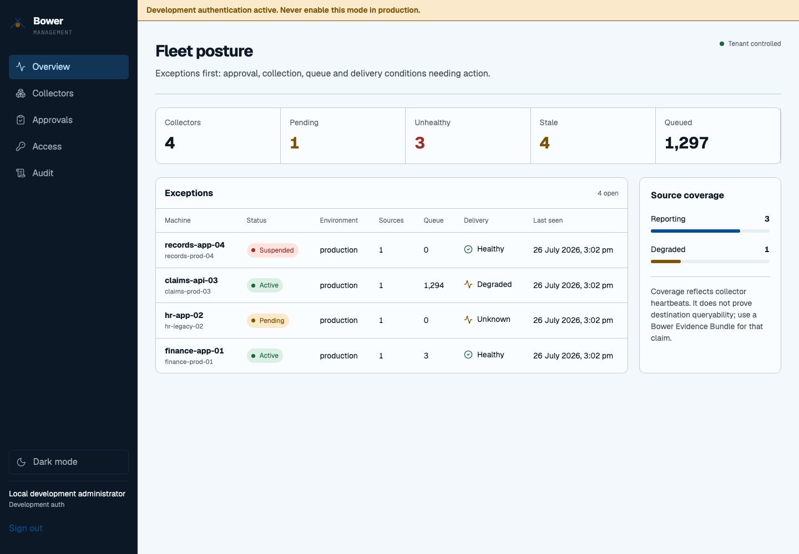
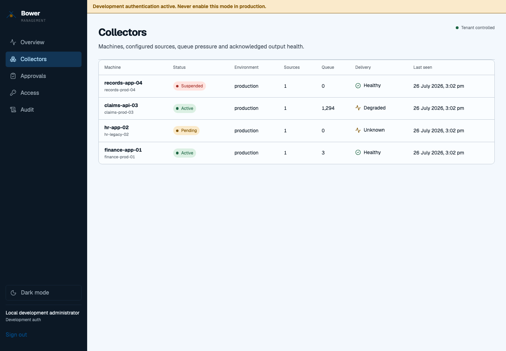
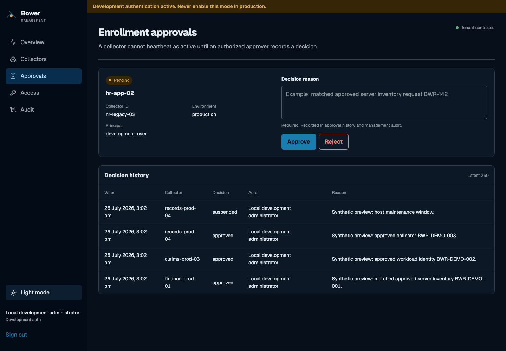
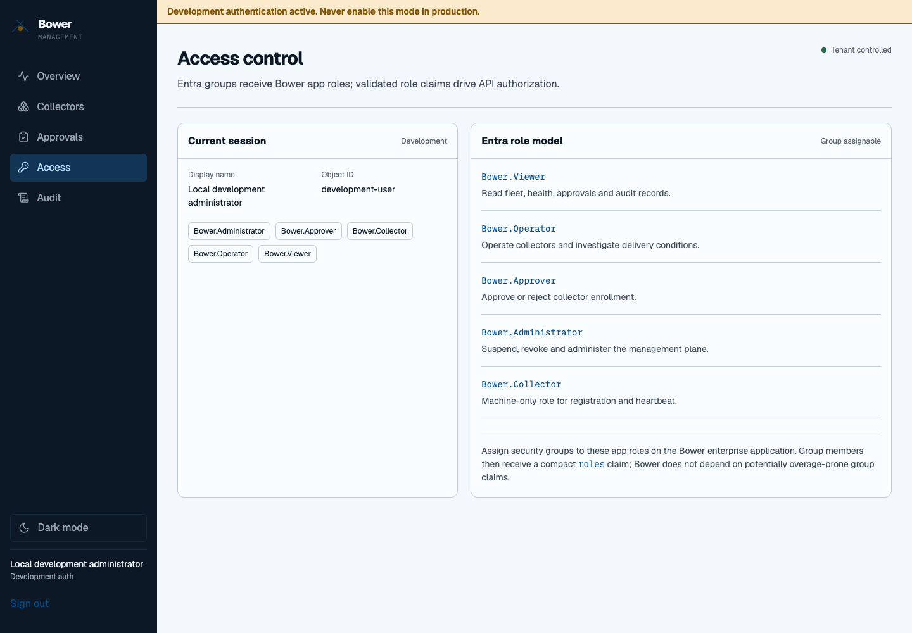
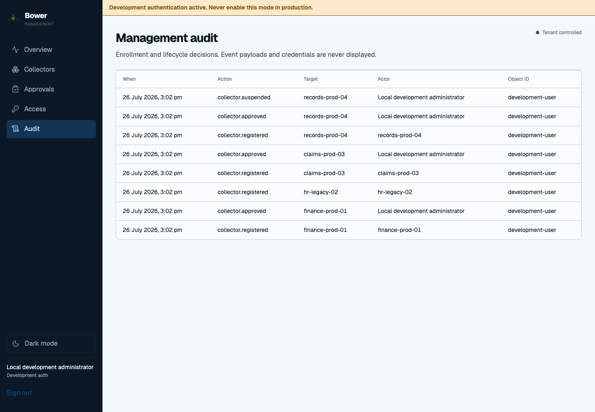
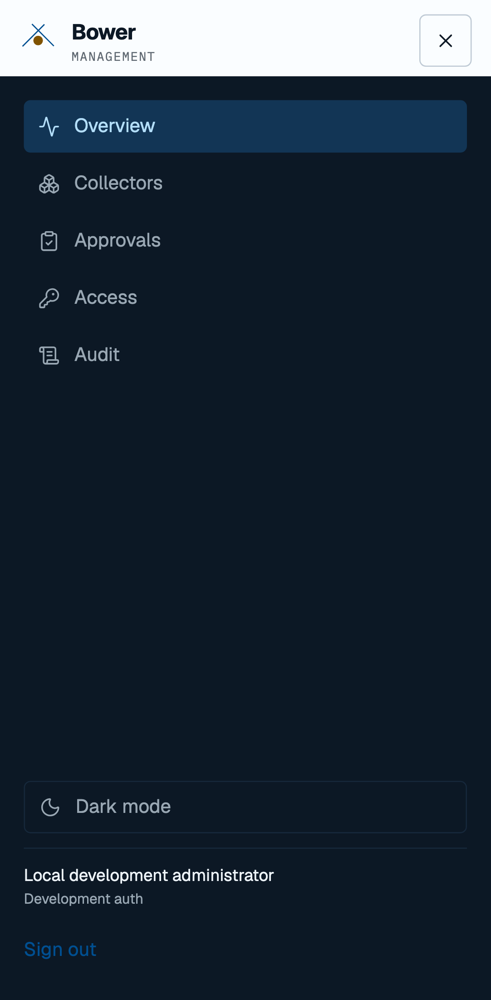

# Bower



> Bower helps security teams collect meaningful security events from custom
> applications and legacy products that do not integrate cleanly with Microsoft
> Sentinel.
>
> Inspired by the Australian bowerbird, Bower deliberately selects and arranges
> valuable security signals rather than forwarding every available log.
>
> It filters low-value noise, validates and redacts records, reliably buffers
> events, and delivers them through Azure Monitor Agent-compatible files or the
> Azure Monitor Logs Ingestion API.
>
> Developers can use the Bower SDK and generated AGENTS.md instructions to
> instrument security-relevant actions consistently without needing to understand
> Sentinel ingestion internals.

**Turn scattered application noise into trusted security signal.**

Bower follows **Collect → Select → Arrange → Deliver → Prove**. It is a
self-hosted security telemetry bridge, not a generic log shipper, APM platform,
SIEM, or replacement for Azure Monitor Agent.

> [!WARNING]
> Bower cannot make inaccurate application events trustworthy. Applications must
> emit semantic events at authoritative points in their workflows. Never send
> passwords, credentials, tokens, cookies, unrestricted bodies, or file contents.

## Project status

**Pre-alpha foundation. Not production-ready.** Current code implements typed
contracts, bounded SDK buffering, local HTTP collection, pre-persistence
redaction, deterministic default-deny policy evaluation, SQLite WAL queue and
deduplication, retry/dead-letter transitions, AMA spool output, real Azure Monitor
Logs Ingestion SDK output, Entra-protected fleet management and approval UI,
basic CLI tooling, schemas and deployment examples.

File, REST and Windows Event Log source adapters, complete catalogue commands,
Roslyn packages, Azure plan/apply, query-backed evidence bundles, release-signing
automation and broad resilience testing remain before v1. No mocked upload is
represented as Sentinel delivery.

## Architecture



Full design: [architecture](docs/architecture/overview.md).

## Supported foundation

| Capability | Status |
|---|---|
| .NET runtime | .NET 10 LTS |
| Windows | `win-x64`, `win-arm64` publishing configured by release workflow |
| Linux | `linux-x64`, `linux-arm64` publishing configured by release workflow |
| macOS | `osx-x64`, `osx-arm64` publishing configured by release workflow |
| Local collector HTTP | Implemented; loopback default |
| Durable SQLite queue | Implemented |
| AMA companion spool | Implemented |
| Logs Ingestion API | Real Azure SDK client implemented; tenant test required |
| Docker, systemd, Kubernetes | Baseline deployment assets |
| Management UI and API | Fleet inventory, approval, health, audit and Entra app-role RBAC implemented |
| Windows Service self-install | Not implemented |
| SQL Server source | EF Core adapter with durable SQLite cursors implemented |
| File, REST, Event Log sources | Not implemented |
| Sentinel query proof/evidence bundle | Not implemented |

## Quick start

Requires .NET 10 SDK.

```bash
dotnet restore
dotnet build --configuration Release
dotnet test --configuration Release

BOWER_QUEUE_PATH=./artifacts/bower.db \
BOWER_POLICY_DIRECTORY=./policies/default \
BOWER_OUTPUT=ama-spool \
BOWER_AMA_SPOOL_PATH=./artifacts/spool \
dotnet run --project src/Bower.Collector
```

In another shell:

```bash
dotnet run --project src/Bower.Cli -- test emit
dotnet run --project src/Bower.Cli -- queue inspect \
  --database ./artifacts/bower.db
```

Canary output proves local receipt, policy acceptance and queue/output state only.
It does not prove Sentinel queryability.

## Self-contained binaries

Bower pins .NET SDK `10.0.302`. Publish single-file, self-contained executables
without requiring .NET on the target machine:

```bash
# Choose one:
# win-x64 win-arm64 linux-x64 linux-arm64 osx-x64 osx-arm64
RID=linux-x64

dotnet publish src/Bower.Cli/Bower.Cli.csproj \
  --configuration Release \
  --runtime "$RID" \
  --self-contained true \
  -p:PublishSingleFile=true \
  --output "artifacts/releases/$RID/cli"

dotnet publish src/Bower.Collector/Bower.Collector.csproj \
  --configuration Release \
  --runtime "$RID" \
  --self-contained true \
  -p:PublishSingleFile=true \
  --output "artifacts/releases/$RID/collector"
```

Windows outputs end in `.exe`; Linux and macOS outputs are native executable
binaries without an extension. CI builds all six RIDs and uploads one artifact
per RID.

### Signing with an organisation-trusted CA

Keep signing keys in an HSM, Azure Key Vault or OS certificate store. Never
commit a private key or PFX. Sign after publishing, then verify before release.
An internal CA only creates trust on machines where the organisation has
distributed that CA root.

For Windows, issue a certificate with the Code Signing EKU, import it into the
signing agent certificate store, and use Authenticode:

```powershell
$artifact = "artifacts\releases\win-x64\cli\bower.exe"
$thumbprint = $env:BOWER_SIGNING_CERT_THUMBPRINT

signtool sign /fd SHA256 /sha1 $thumbprint `
  /tr https://timestamp.example.org /td SHA256 $artifact
signtool verify /pa /all /v $artifact
```

For Linux, or cross-platform verification with the same organisation CA, create
a detached CMS signature and distribute the approved CA chain:

```bash
artifact="artifacts/releases/linux-x64/cli/bower"

openssl cms -sign -binary -md sha256 \
  -in "$artifact" \
  -signer org-code-signing.crt \
  -inkey org-code-signing.key \
  -outform DER -nosmimecap \
  -out "$artifact.p7s"

openssl cms -verify -binary -inform DER \
  -in "$artifact.p7s" \
  -content "$artifact" \
  -CAfile org-code-signing-chain.pem \
  -purpose any -out /dev/null
```

An organisation CA does not satisfy macOS Gatekeeper for external distribution.
Sign macOS binaries with an Apple Developer ID Application identity and notarise
the release archive; optionally add the detached organisation CMS signature for
internal assurance:

```bash
artifact="artifacts/releases/osx-arm64/cli/bower"

codesign --force --options runtime --timestamp \
  --sign "Developer ID Application: Example Org (TEAMID)" "$artifact"
codesign --verify --strict --verbose=2 "$artifact"

ditto -c -k --keepParent "$artifact" "$artifact.zip"
xcrun notarytool submit "$artifact.zip" \
  --keychain-profile BOWER_NOTARY --wait
```

See Microsoft guidance for
[SignTool](https://learn.microsoft.com/dotnet/framework/tools/signtool-exe) and
[macOS notarisation for .NET](https://learn.microsoft.com/dotnet/core/install/macos-notarization-issues).

## Management UI

Bower includes a self-hosted React management console and ASP.NET Core API.
Expand any section below for an exhaustive tour of shipped console functionality.

<details>
  <summary><strong>Fleet posture and health</strong> — collector status, source coverage, queue pressure, output health and recent activity</summary>
  <p>
    Fleet-wide counts expose active, unhealthy, stale and pending collectors.
    Health cards identify source and delivery conditions without displaying event
    payloads or credentials.
  </p>
  
</details>

<details>
  <summary><strong>Collector and machine inventory</strong> — lifecycle state, environment, source count, queue depth, delivery state and last heartbeat</summary>
  <p>
    Inventory records which machines are sending telemetry and makes missing,
    degraded or backlogged collectors visible.
  </p>
  
</details>

<details>
  <summary><strong>Reasoned enrollment approvals</strong> — pending identity review, approve or reject controls, role enforcement and decision history</summary>
  <p>
    Pending collectors cannot become active until an authorized approver records
    a reason. The same view preserves immutable decision history. Dark mode is
    included.
  </p>
  
</details>

<details>
  <summary><strong>Microsoft Entra ID SSO and group-based RBAC</strong> — current identity, role claims and group-assignable Bower app roles</summary>
  <p>
    The console shows the authenticated session and documents the
    <code>Bower.Viewer</code>, <code>Bower.Operator</code>,
    <code>Bower.Approver</code>, <code>Bower.Administrator</code> and
    machine-only <code>Bower.Collector</code> roles.
  </p>
  
</details>

<details>
  <summary><strong>Management audit history</strong> — enrollment and lifecycle actions with time, target, actor and Entra object ID</summary>
  <p>
    Audit rows identify who changed collector state and what changed. Event
    payloads and credentials are never displayed.
  </p>
  
</details>

<details>
  <summary><strong>Responsive operations</strong> — mobile navigation, fleet posture and touch-friendly access to every console area</summary>
  <p>
    The same operational workflow remains usable on narrow screens without
    horizontal page overflow.
  </p>
  
</details>

Screenshots use synthetic fleet metadata from the loopback-only development
preview. The production deployment requires Entra ID authentication.

Entra security groups are assigned to Bower app roles. Group members receive the
role in their access token, avoiding direct dependence on large or overage-prone
group claims. The interactive roles are `Bower.Viewer`, `Bower.Operator`,
`Bower.Approver` and `Bower.Administrator`; collector service principals receive
the separate `Bower.Collector` role.

```bash
# Explicit local-only development mode.
ASPNETCORE_ENVIRONMENT=Development \
BOWER_AUTH_MODE=development \
BOWER_MANAGEMENT_DB_PATH=./artifacts/management.db \
dotnet run --project src/Bower.Management.Api

cd ui/Bower.Management.Web
cp .env.example .env.local
# Set VITE_BOWER_AUTH_MODE=development only for local development.
npm ci
npm run dev

# Against a running management deployment:
BOWER_UI_BASE_URL=http://127.0.0.1:4320 npm run test:e2e
BOWER_UI_BASE_URL=http://127.0.0.1:4320 npm run screenshots
```

Production Entra setup and collector identity flow:
[management identity and RBAC](docs/security/management-identity-and-rbac.md).
The UI shell is original Bower code informed by the MIT-licensed
[Shadcn Dashboard](https://github.com/shadcndashboard/shadcndashboard) layout
patterns.

## Developer SDK

```csharp
builder.Services.AddBower(options =>
{
    options.Application.Name = "CustomerPortal";
    options.Application.Environment = builder.Environment.EnvironmentName;
    options.Application.Instance = Environment.MachineName;
    options.LocalCollector.Endpoint = "http://127.0.0.1:4319";
    options.FailApplicationOnTelemetryFailure = false;
});

await bower.AuthenticationFailedAsync(
    new AuthenticationFailedEvent
    {
        Username = request.Username,
        SourceIpAddress = httpContext.Connection.RemoteIpAddress,
        FailureReason = "InvalidPassword",
        CorrelationId = httpContext.TraceIdentifier
    },
    cancellationToken);
```

SDK enqueues into bounded memory and sends asynchronously. Default behavior is
fail-open for business work. Buffer overflow returns a structured failure.

Initialize guidance in another .NET repository:

```bash
bower developer init --path ./CustomerPortal
```

Existing `AGENTS.md` content is preserved; Bower owns only marked section.

## Policy

Policies are versioned YAML, hashed after parsing and cannot execute code:

```yaml
apiVersion: bower.security/v1
kind: TelemetryPolicy
metadata:
  id: BWR-POL-AUTH-FAILURE
  name: Authentication failures
  version: 1.0.0
  owner: Security Operations
match:
  eventCategories: [authentication]
  eventTypes: [authentication_failure]
requirements:
  requiredFields: [timeGenerated, eventType, eventResult, application.name]
  atLeastOne: [actor.userId, actor.username]
decision:
  action: accept
  minimumValueScore: 70
  neverSample: true
```

Unknown events are rejected. Missing required investigation context is
quarantined. Policy response includes ID, version, hash, score and reasons.

## Outputs

AMA companion mode writes one UTF-8 JSON object per line through an active
temporary file and atomic rename into a ready directory. Configure AMA and its
DCR to watch only ready files. Bower does not modify AMA.

Direct mode uses `Azure.Monitor.Ingestion.LogsIngestionClient` with
`DefaultAzureCredential`; managed/workload identity is preferred. Set:

```text
BOWER_OUTPUT=azure-logs-ingestion
BOWER_DCE_ENDPOINT=https://<dce>.<region>.ingest.monitor.azure.com
BOWER_DCR_ID=dcr-<immutable-id>
BOWER_STREAM_NAME=Custom-BowerSecurity
```

Azure upload acknowledgement still needs a Log Analytics query before evidence
can claim end-to-end delivery.

## SQL Server source adapter

`Bower.Source.SqlServer` ships a real EF Core adapter for legacy audit tables.
It does not accept free-form SQL. Table and column identifiers are validated,
EF Core generates parameterised predicates, `Take` bounds every batch, and
cursor-specific LINQ ordering is fixed by the adapter.

Supported cursors:

- incrementing sequence;
- timestamp with optional bounded replay overlap;
- composite timestamp plus sequence.

Fingerprints remain stable across overlap replay. A saturated overlap window
fails explicitly instead of silently skipping records. Cursor checkpoints use
an EF Core SQLite store with optimistic concurrency and survive process restart.
Commit a checkpoint only after every selected event in that batch is durably
persisted.

```csharp
EfSourceCursorStore cursorStore = new("./data/sql-source-cursors.db");
await cursorStore.InitializeAsync(cancellationToken);

SqlServerSourceAdapter source = new(
    new SqlServerSourceOptions
    {
        SourceId = "legacy-finance-audit",
        ConnectionString = Environment.GetEnvironmentVariable("BOWER_FINANCE_SQL")
            ?? throw new InvalidOperationException("BOWER_FINANCE_SQL is required."),
        Schema = "dbo",
        Table = "AuditLog",
        CursorKind = SqlServerCursorKind.Incrementing,
        BatchSize = 1_000,
        Columns = new SqlServerColumnMappings
        {
            Sequence = "AuditId",
            EventTime = "EventTime",
            Username = "Username",
            Action = "Action",
            TargetType = "TargetType",
            TargetId = "TargetId",
            PreviousValue = "PreviousValue",
            NewValue = "NewValue",
            SourceIpAddress = "SourceIp"
        }
    },
    cursorStore);

SqlServerPollBatch batch = await source.PollAsync(cancellationToken);

// Map and process each record through Bower redaction, validation and policy.
// Commit only after those accepted events are durable.
if (batch.Checkpoint is not null)
{
    await source.CommitAsync(batch.Checkpoint, cancellationToken);
}
```

The connection must specify `Application Intent=ReadOnly`. Use a database
principal restricted to `SELECT` on the approved audit table or view. Bower does
not create, alter or delete source database objects.

## Evidence

Current local records capture policy hash, configuration identity, queue state and
destination acknowledgement. v1 evidence bundles will add canary generation,
Log Analytics query result, required-field verification and latency. Simulated
and inaccessible evidence will never pass.

## Contributing

Read [CONTRIBUTING.md](CONTRIBUTING.md), root `AGENTS.md`, nearest scoped
instructions and [security policy](SECURITY.md). All first-party warnings are
errors. New behavior needs tests and honest documentation.
