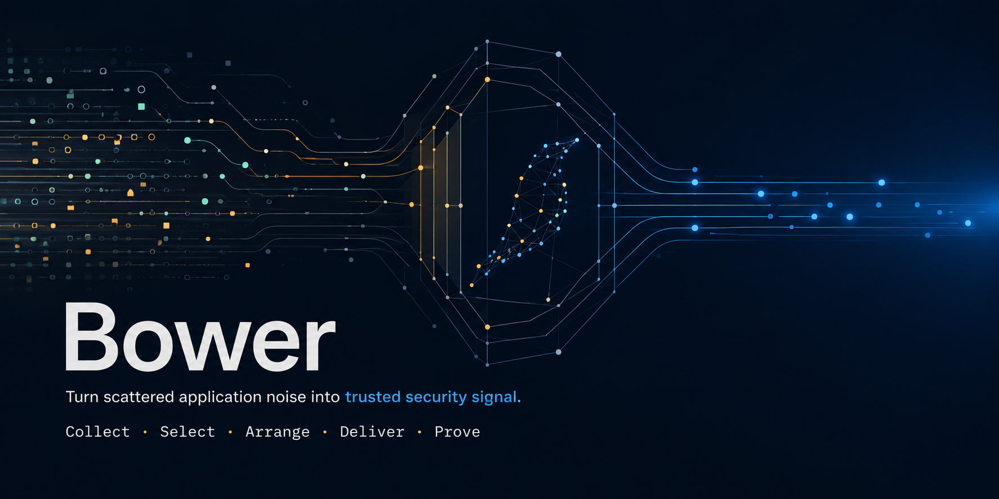
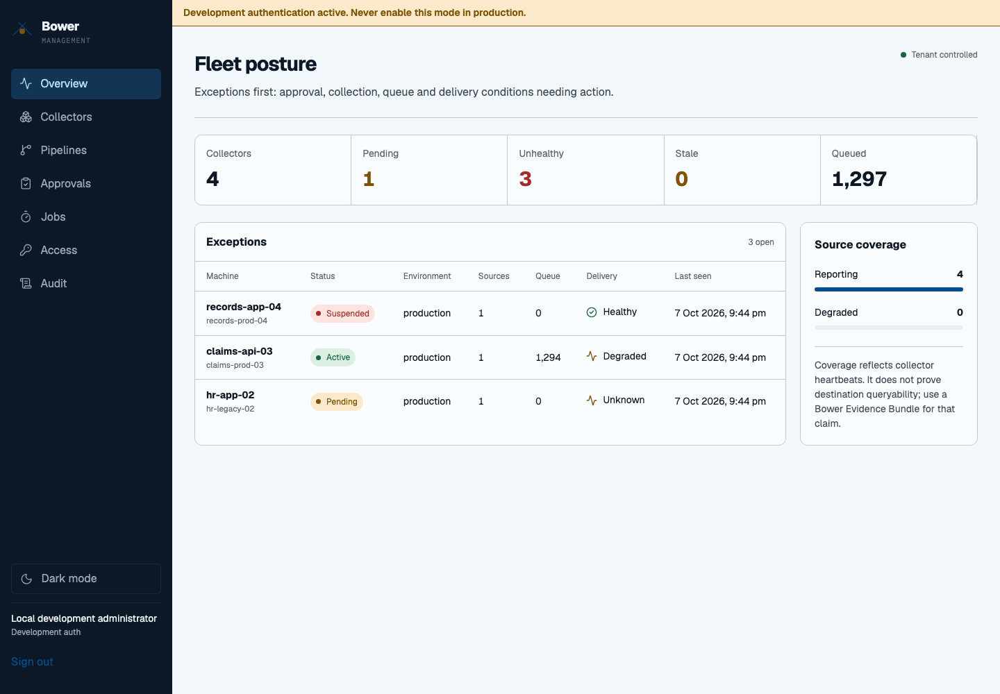
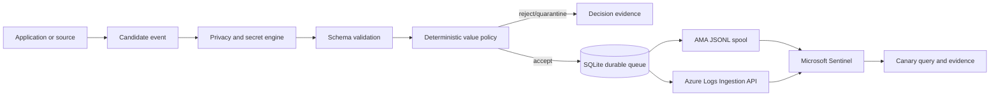
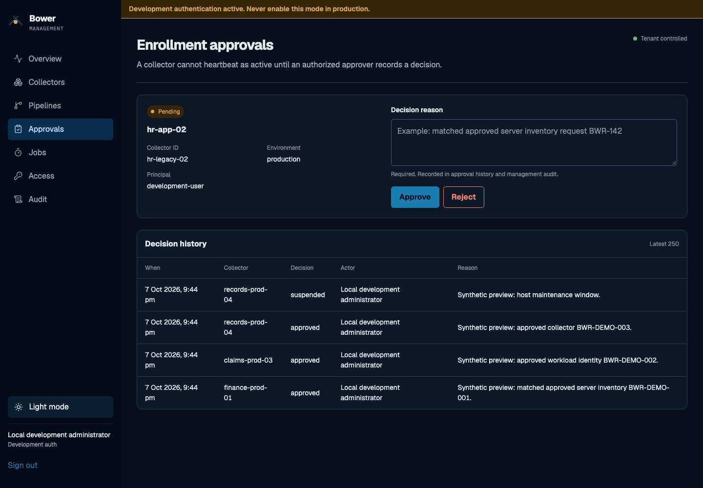
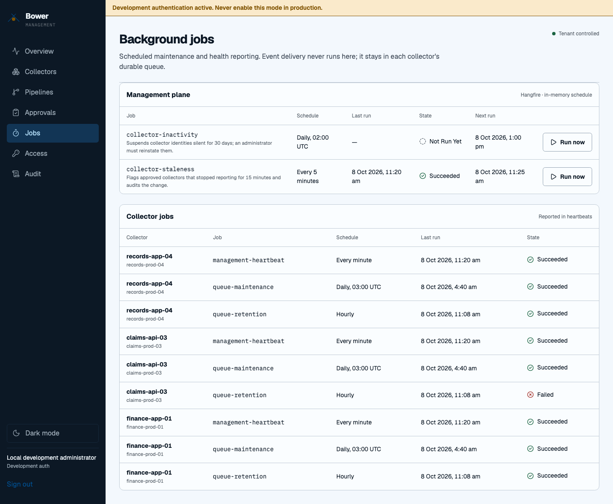
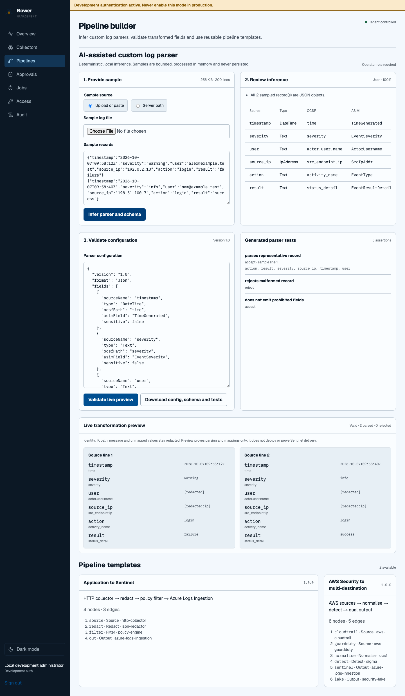
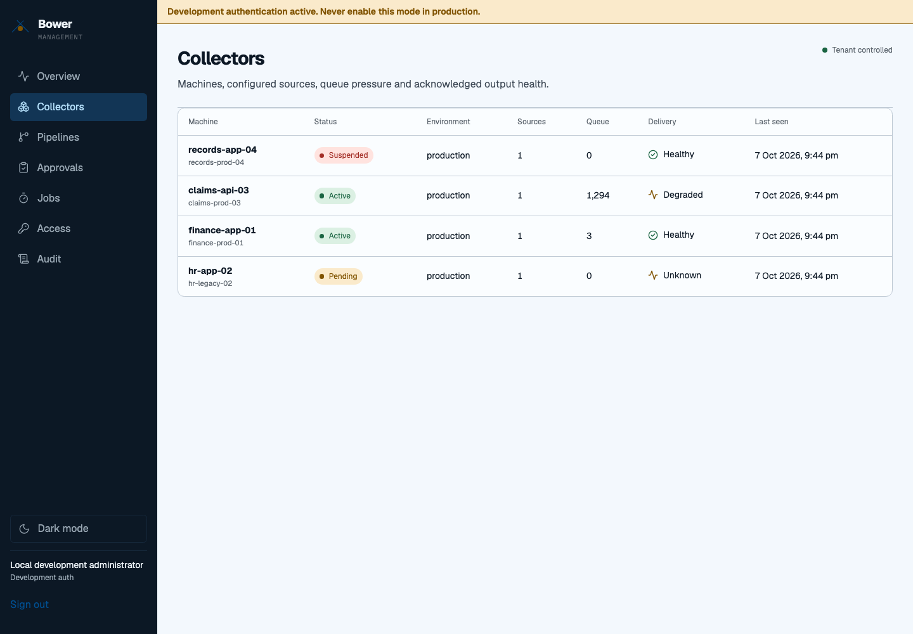
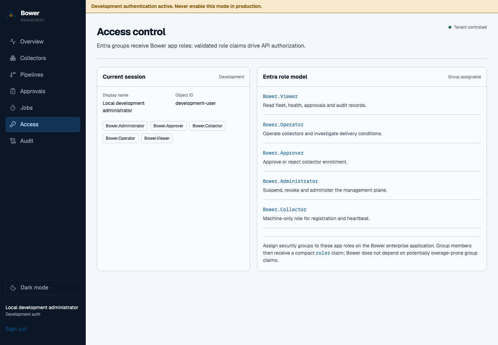
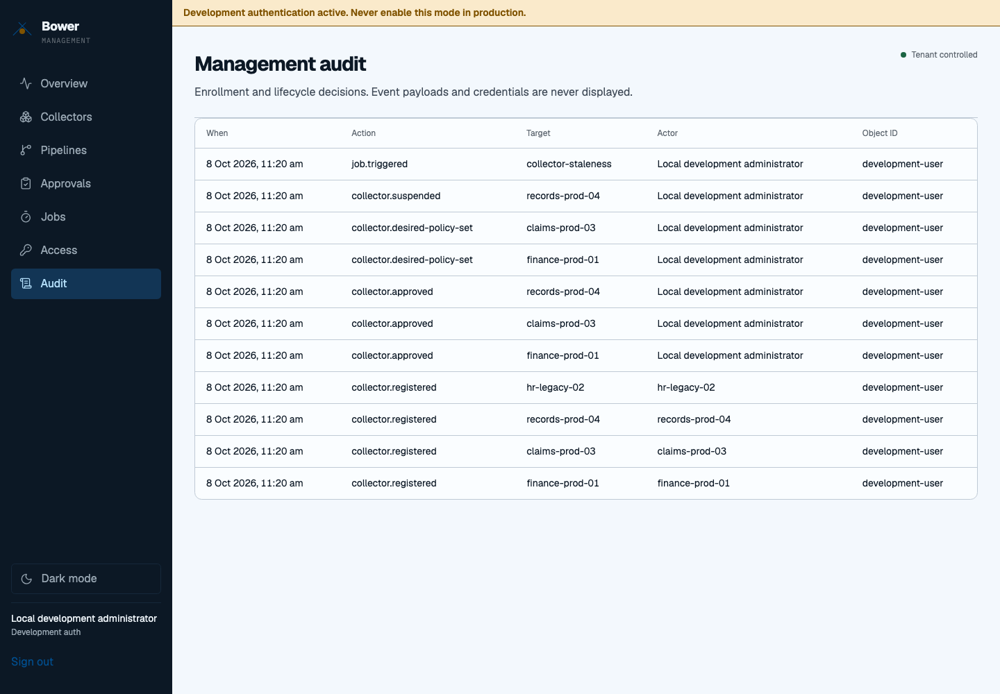
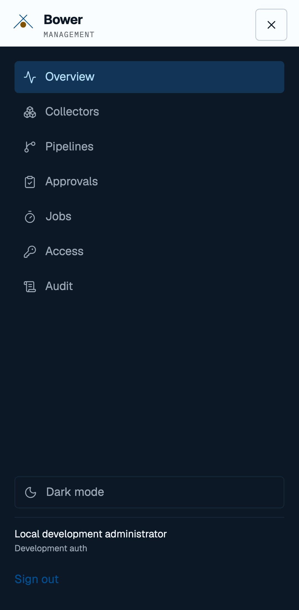

# Bower



> Bower helps security teams collect meaningful security events from custom
> applications and legacy products that do not integrate cleanly with Microsoft
> Sentinel.
>
> Inspired by the Australian bowerbird, Bower deliberately selects and arranges
> valuable security signals rather than forwarding every available log.
>
> It filters low-value noise, runs a deterministic **Privacy & Secret Protection
> Engine** (Australian-regulated identifiers first), validates and redacts
> records, reliably buffers events, and delivers them through Azure Monitor
> Agent-compatible files or the Azure Monitor Logs Ingestion API.
>
> Developers can use the Bower SDK and generated AGENTS.md instructions to
> instrument security-relevant actions consistently without needing to understand
> Sentinel ingestion internals.

**Turn scattered application noise into trusted security signal — without
shipping Australian PII, credentials or secrets downstream.**

## Why Bower

Azure Monitor Agent, Elastic Agent and Cribl Stream move logs. Bower makes a narrower
promise and proves it: **only approved security events, with Australian personal data
removed on the host, provably arriving in Sentinel.**

| | Bower | Typical alternative |
|---|---|---|
| **Proof of arrival** | `bower evidence run` sends a canary, finds it in Sentinel with KQL, records latency and retention, maps it to ISM / Essential Eight controls and signs the result | AMA, Elastic and Cribl stop at "the API accepted it"; checking Sentinel is manual |
| **Redaction before data leaves the host** | Deterministic engine with checksum-validated TFN, Medicare, IHI, CRN, ABN/ACN, cards and secrets; runs before anything is stored; any failure quarantines | DCR transformations redact in Azure after transfer; Elastic's redact processor runs in Elasticsearch on a paid licence; ML-based detectors elsewhere |
| **Default deny** | Only event types an approved, versioned policy names are kept; everything else is rejected and explained | Forward everything configured, then filter |
| **No silent loss** | Durable queue that deletes only after acknowledgement, attempt-limited dead letters with replay, preflight against Azure's 64 KB / type / schema limits, `bower doctor` and DCR drift checks | Azure truncates and drops rows without a per-record error |
| **Tamper evidence** | Hash-chained queue ledger, head witnessed by the management plane | Not offered at the collector |
| **Signed content** | Packs (policy, privacy profile, parsers, detections, samples, DCR) are signed, hash-pinned and tested before signing | Unsigned community content |
| **Sovereignty** | Self-hosted, region checks for Australian endpoints, no data leaves your tenant except to your Sentinel | Hosted control planes; Sentinel processes Australian workspace data in a US region |

The comparison reflects vendor documentation reviewed in October 2026; see the
[competitive analysis](docs/research/competitive-analysis-2026-10.md) for sources and
caveats.



*The management console with synthetic preview data. Walkthrough below.*

Bower follows **Collect → Select → Arrange → Deliver → Prove**. It is a
self-hosted security telemetry privacy gateway, not a generic log shipper, APM
platform, SIEM, or replacement for Azure Monitor Agent.

### Australian privacy focus

Bower is built for Australian security operations. Before any event is
persisted or forwarded, the **Privacy & Secret Protection Engine** inspects
every string and number value, and every property name, with deterministic pattern matching, checksum validation and
policy actions (no AI at runtime):

| Australian identifiers | Validation |
|---|---|
| Tax File Numbers (TFN) | ATO 8/9-digit checksum; default masked to last 4 digits |
| Centrelink CRN | Pattern (digits + check letter) |
| Medicare numbers | Official check digit + issue number |
| Individual Healthcare Identifiers (IHI) | `800360…` + Luhn |
| ABN / ACN | Mod-89 / company check digit |
| Passport, driver licence (state formats), DVA | Format + context |

Also covered: payment cards (Luhn), BSB/account, IBAN/SWIFT/PayID; email and
Australian/international phone numbers; cloud credentials (AWS, Azure, Entra,
GCP), JWT/OAuth, common API keys; PEM/SSH/PGP keys; optional protective security
markings (OFFICIAL through TOP SECRET).

Configurable actions per detector: Allow, Remove, Replace, Mask, SHA-256, HMAC,
Encrypt, AlertOnly. Events emit `privacy` metadata describing what was detected
and which action ran — **never** the original values.

**Security team notification:** high-risk findings (regulated AU identifiers,
secrets, crypto material, payment cards, field-name secrets) also enqueue a
first-class semantic event `sensitive_data_detected` (`privacy-control`) so the
SOC can alert in Sentinel/SIEM. Routine email/phone masking alone does not fire
that event (noise control). Original values are never included on the alert.

Full catalogue, policy configuration, SOC event shape and extension points:
[Privacy & Secret Protection Engine](docs/privacy/privacy-secret-engine.md).

> [!WARNING]
> Bower cannot make inaccurate application events trustworthy. Applications must
> emit semantic events at authoritative points in their workflows. Never send
> passwords, credentials, tokens, cookies, unrestricted bodies, or file contents.

## Project status

**Pre-alpha foundation. Not production-ready.** Current code implements typed
contracts, bounded SDK buffering, local HTTP collection, the Australian-first
Privacy & Secret Protection Engine (pre-persistence), deterministic default-deny
policy evaluation, SQLite WAL queue and deduplication, retry/dead-letter
transitions, AMA spool output, real Azure Monitor Logs Ingestion SDK output,
Entra-protected fleet management and approval UI, Sentinel query-verified evidence
bundles, signed packs, DCR generation and drift checks, a tamper-evident queue
ledger, CLI tooling, schemas and deployment examples.

Runtime file, REST and Windows Event Log source adapters, complete catalogue commands,
Roslyn packages, Azure plan/apply, release-signing automation, a tenant-tested
evidence run and broad resilience testing remain before v1. No mocked upload is
represented as Sentinel delivery.

## Architecture


```mermaid
flowchart LR
    A[Application or source] --> B[Candidate event]
    B --> C[Privacy and secret engine]
    C --> D[Schema validation]
    D --> E[Deterministic value policy]
    E -->|reject/quarantine| F[Decision evidence]
    E -->|accept| G[(SQLite durable queue)]
    G --> H[AMA JSONL spool]
    G --> I[Azure Logs Ingestion API]
    H --> J[Microsoft Sentinel]
    I --> J
    J --> K[Canary query and evidence]
```

Full design: [architecture](docs/architecture/overview.md).

## Supported foundation

| Capability | Status |
|---|---|
| .NET runtime | .NET 10 LTS |
| Windows | `win-x64`, `win-arm64` publishing configured by release workflow |
| Linux | `linux-x64`, `linux-arm64` publishing configured by release workflow |
| macOS | `osx-x64`, `osx-arm64` publishing configured by release workflow |
| Local collector HTTP | Implemented; loopback default; bearer-token ingest auth and rate limiting off-host |
| Privacy & Secret Protection Engine | Implemented; AU identifiers (TFN, CRN, Medicare, IHI, ABN/ACN, …), secrets, crypto; policy actions + metadata; high-risk findings emit `sensitive_data_detected` for SOC |
| Durable SQLite queue | Implemented; retention purge, undelivered-byte cap, attempt-limited dead-lettering, replay, tamper-evident ledger |
| Background jobs | Hangfire (in-memory) for retention, maintenance, heartbeat and staleness |
| AMA companion spool | Implemented |
| Logs Ingestion API | Real Azure SDK client implemented; tenant test required |
| Docker, systemd, Kubernetes | Baseline deployment assets |
| Console container | Standalone nginx image configured at runtime (`Dockerfile.web`) |
| Docker sidecar | Read-only collection from opted-in containers' json-file logs (`Bower.Agent.Docker`) |
| Management UI and API | Fleet inventory, approval, health, audit, custom-log parser generation and Entra app-role RBAC implemented |
| AI-assisted custom log parser generator | Deterministic local JSON, CSV, key/value and common-regex inference with OCSF/ASIM mappings and redacted preview |
| Windows Service self-install | Not implemented |
| SQL Server source | EF Core adapter with durable SQLite cursors implemented |
| File, REST, Event Log sources | Not implemented |
| Sentinel query proof/evidence bundle | Implemented: canary + KQL arrival + retention + ISM/E8 mapping, signed (`bower evidence`); tenant test required |
| Signed Bower Packs | Implemented: policy, privacy profile, parsers, detections, samples, DCR template; tested before signing |
| DCR generator, drift and doctor | Implemented: schema-driven ARM template, live/offline drift, ingestion preflight, region checks |
| Fleet controls | Per-producer revocable ingest tokens, desired-policy acknowledgement, inactivity suspension and reinstate |
| Queue integrity | Hash-chained ledger witnessed by management; dead-letter holding area with replay |
| Privacy profiles | YAML detector actions, HMAC pseudonymisation with key ids, truncation, field-length cap |

## Getting started

Requires the .NET 10 SDK (`10.0.401`, pinned in `global.json`) and Node.js 26 for
the console. Everything below runs locally with synthetic data.

### 1. Build and test

```bash
dotnet restore
dotnet build --configuration Release
dotnet test --configuration Release
```

### 2. Run a collector and send a canary event

A collector bound to loopback accepts events without a token:

```bash
BOWER_QUEUE_PATH=./artifacts/bower.db \
BOWER_POLICY_DIRECTORY=./policies/default \
BOWER_OUTPUT=ama-spool \
BOWER_AMA_SPOOL_PATH=./artifacts/spool \
dotnet run --project src/Bower.Collector
```

In another shell, emit a synthetic authentication failure and inspect the queue:

```bash
dotnet run --project src/Bower.Cli -- test emit
dotnet run --project src/Bower.Cli -- queue inspect --database ./artifacts/bower.db
curl -s http://127.0.0.1:4319/health          # {"status":"healthy"}
```

`test emit` prints the policy decision (`accept`, policy id, hash and score). The
event is redacted, queued, and written to `./artifacts/spool/ready/` as JSONL for
Azure Monitor Agent. Canary output proves local receipt, policy acceptance and
queue/output state only; it does not prove Sentinel queryability.

### 3. Expose the collector to other hosts

Any non-loopback listener requires a shared ingest token; the collector refuses to
start without one.

```bash
export BOWER_INGEST_TOKEN="$(dotnet run --project src/Bower.Cli -- token generate)"
BOWER_LISTEN_URL=http://0.0.0.0:4319 dotnet run --project src/Bower.Collector

# Producers send it as a bearer token. The CLI reads BOWER_INGEST_TOKEN:
dotnet run --project src/Bower.Cli -- test emit --endpoint http://collector:4319
curl -s -H "Authorization: Bearer $BOWER_INGEST_TOKEN" http://127.0.0.1:4319/v1/status
```

In the SDK set `options.LocalCollector.IngestToken` from your secret store. For
containers, prefer `BOWER_INGEST_TOKEN_FILE` pointing at a mounted secret.

### 4. Run the management console with preview data

```bash
# Terminal 1: management API in explicit local-only development mode
ASPNETCORE_ENVIRONMENT=Development BOWER_AUTH_MODE=development \
BOWER_MANAGEMENT_DB_PATH=./artifacts/management.db \
dotnet run --project src/Bower.Management.Api

# Terminal 2: console on http://127.0.0.1:5173
cd ui/Bower.Management.Web
cp .env.example .env.local
# Edit .env.local: VITE_BOWER_AUTH_MODE=development (local development only)
npm ci
npm run dev

# Terminal 3: synthetic collectors, approvals, heartbeats and job reports
cd ui/Bower.Management.Web && npm run seed:preview
```

The seed script refuses to run unless the API reports development
authentication. Then walk through the console:

1. **Overview** (shown at the top of this README) puts exceptions first: the
   pending `hr-app-02`, the degraded `claims-api-03` with 1,294 queued events,
   and the suspended `records-app-04`.

2. **Approvals** — a pending collector cannot send heartbeats until an approver
   records a reason. Enter one and approve `hr-app-02`; the decision appears in
   history and in **Audit**.

   

3. **Jobs** shows Hangfire schedules: the management `collector-staleness` job
   (administrators can *Run now*) and each collector's retention, maintenance and
   heartbeat jobs. `claims-api-03` reports a failed retention run.

   

4. **Pipelines** — paste JSON log lines and choose *Infer parser and schema*.
   Bower infers field types and OCSF/ASIM mappings, generates parser tests, and
   shows a live preview with identities and IP addresses redacted.

   

### 5. Run the full stack in Docker

```bash
export BOWER_INGEST_TOKEN="$(dotnet run --project src/Bower.Cli -- token generate)"
docker compose -f deploy/docker/compose.homelab.yaml up --build
```

This starts a collector on `127.0.0.1:4319` and the development-auth console on
`127.0.0.1:4320`. It is a homelab preview; production management requires Entra ID
(see [management identity and RBAC](docs/security/management-identity-and-rbac.md)).

For production, run the console as its own container configured at start-up —
`deploy/docker/compose.console.yaml` pairs it with the management API. See
[standalone console image](docs/deployment/console-image.md).

### 6. Collect security events from an existing Docker stack

Add the sidecar to any Compose stack and label the containers it may read. The
compose file uses the published `ghcr.io/jusso-dev/bower-sidecar` image:

```bash
docker compose -f compose.yaml -f /path/to/bower/deploy/docker/compose.sidecar.yaml up -d
```

```yaml
services:
  ssh-gateway:
    labels:
      bower.collect: "true"
```

The sidecar runs as a non-root user and reads Docker's json-file logs through a
read-only mount (no Docker socket). It forwards Bower JSON events and recognised
sign-in failures and lockouts, and drops everything else. Try the full flow with
`docker compose -f deploy/docker/compose.sidecar-demo.yaml up --build`. Details:
[Docker sidecar](docs/deployment/docker-sidecar.md).

## Container images

Every `main` commit that passes CI publishes multi-arch (`amd64`, `arm64`) images to
GitHub Container Registry with SBOMs and signed build provenance; `vX.Y.Z` tags
publish versioned and `latest` tags.

```bash
docker pull ghcr.io/jusso-dev/bower-collector:edge
docker pull ghcr.io/jusso-dev/bower-management:edge
docker pull ghcr.io/jusso-dev/bower-web:edge
docker pull ghcr.io/jusso-dev/bower-sidecar:edge
```

Tags, verification and runtime configuration:
[container images](docs/deployment/container-images.md).

## Collector configuration

| Variable | Default | Purpose |
|---|---|---|
| `BOWER_LISTEN_URL` | `http://127.0.0.1:4319` | HTTP listener. Non-loopback requires a token. |
| `BOWER_INGEST_TOKEN` / `BOWER_INGEST_TOKEN_FILE` | — | Shared bearer token (≥ 32 characters) for `/v1/events` and `/v1/status`. |
| `BOWER_INGEST_TOKENS_FILE` | — | Per-producer revocable credentials (`<producer> sha256:<hex>` lines, hot reloaded). |
| `BOWER_PACKS` / `BOWER_PACK_TRUSTED_KEYS` | — | Signed `.bowerpack` files to load, and the public keys trusted to sign them. |
| `BOWER_PRIVACY_PROFILE` | — | Privacy profile YAML (detector actions, HMAC field rules, length limits). |
| `BOWER_PRIVACY_HMAC_KEY_FILE` / `BOWER_PRIVACY_HMAC_KEY_ID` | — / `k1` | Pseudonymisation key (32+ bytes, base64) and the id embedded in HMAC output. |
| `BOWER_ALLOW_UNAUTHENTICATED_INGEST` | `false` | Explicit opt-out for isolated networks only. |
| `BOWER_INGEST_RATE_PER_SECOND` | `500` | Token-bucket limit (burst 2×); excess returns HTTP 429. |
| `BOWER_QUEUE_PATH` | `./data/bower.db` | SQLite queue. |
| `BOWER_QUEUE_MAX_BYTES` | 10 GiB | Cap on **undelivered** bytes; excess returns HTTP 503. |
| `BOWER_QUEUE_RETENTION_HOURS` | `168` | How long acknowledged events stay for duplicate detection. |
| `BOWER_MAX_DELIVERY_ATTEMPTS` | `20` | Retryable failures dead-letter after this many leases. |
| `BOWER_POLICY_DIRECTORY` | `./policies/default` | Versioned policy YAML. |
| `BOWER_OUTPUT` | `none` | `none`, `ama-spool` or `azure-logs-ingestion`. |
| `BOWER_AZURE_CREDENTIAL` | `managed-identity` | `managed-identity`, `workload-identity`, `environment` or `azure-cli`. |
| `BOWER_AZURE_CLIENT_ID` | — | User-assigned managed identity client id. |
| `BOWER_MANAGEMENT_ENDPOINT` / `BOWER_MANAGEMENT_SCOPE` | — | Enables the heartbeat job. HTTPS required unless loopback. |

## Background jobs

Recurring maintenance runs on [Hangfire](https://www.hangfire.io/) with in-memory
storage; event delivery stays in the durable queue's low-latency worker.

| Host | Job | Schedule (UTC) |
|---|---|---|
| Collector | `queue-retention` — purge acknowledged events past retention | Hourly |
| Collector | `queue-maintenance` — WAL checkpoint and `PRAGMA optimize` | Daily 03:00 |
| Collector | `management-heartbeat` — register and report health | Every minute |
| Management API | `collector-staleness` — flag and audit silent collectors | Every 5 minutes |

Design, observability and how to add a job:
[background jobs](docs/operations/background-jobs.md). Dependency rationale:
[dependency decisions](docs/architecture/dependencies.md).

## Operating Bower

| Task | Command | Details |
|---|---|---|
| Prove delivery to Sentinel | `bower evidence run --collector-url … --workspace-id … --signing-key …` | [Evidence bundles](docs/operations/evidence-bundles.md) |
| Check a deployment | `bower doctor --collector-url … --dcr-resource-id … --workspace-resource-id …` | [Doctor and DCRs](docs/operations/doctor-and-dcr.md) |
| Generate / diff the DCR | `bower dcr generate --out bower-dcr.json` · `bower dcr diff --rule rule.json` | [Doctor and DCRs](docs/operations/doctor-and-dcr.md) |
| Build and sign a pack | `bower pack build packs/linux-ssh-gateway --key bower-signing.key.pem` | [Packs](docs/deployment/packs.md) |
| Issue / revoke a producer token | `bower token generate --id sidecar-01` | [Fleet and queue integrity](docs/operations/fleet-and-queue-integrity.md) |
| Replay dead letters | `bower queue dead-letters` · `bower queue replay --code preflight-` | [Fleet and queue integrity](docs/operations/fleet-and-queue-integrity.md) |
| Verify queue integrity | `bower queue verify --database queue.db` | [Fleet and queue integrity](docs/operations/fleet-and-queue-integrity.md) |
| Pseudonymise identifiers | privacy profile `action: hmac` + `BOWER_PRIVACY_HMAC_KEY_FILE` | [Privacy engine](docs/privacy/privacy-secret-engine.md) |

## Self-contained binaries

Bower pins .NET SDK `10.0.401` and runs tests on Microsoft.Testing.Platform.
Publish single-file, self-contained executables without requiring .NET on the
target machine:

```bash
# Choose one:
# win-x64 win-arm64 linux-x64 linux-arm64 osx-x64 osx-arm64
RID=linux-x64

dotnet publish src/Bower.Cli/Bower.Cli.csproj \
  --configuration Release \
  --runtime "$RID" \
  --self-contained true \
  -p:PublishSingleFile=true \
  --output "artifacts/releases/$RID/cli"

dotnet publish src/Bower.Collector/Bower.Collector.csproj \
  --configuration Release \
  --runtime "$RID" \
  --self-contained true \
  -p:PublishSingleFile=true \
  --output "artifacts/releases/$RID/collector"
```

Windows outputs end in `.exe`; Linux and macOS outputs are native executable
binaries without an extension. CI builds all six RIDs and uploads one artifact
per RID.

### Signing with an organisation-trusted CA

Keep signing keys in an HSM, Azure Key Vault or OS certificate store. Never
commit a private key or PFX. Sign after publishing, then verify before release.
An internal CA only creates trust on machines where the organisation has
distributed that CA root.

For Windows, issue a certificate with the Code Signing EKU, import it into the
signing agent certificate store, and use Authenticode:

```powershell
$artifact = "artifacts\releases\win-x64\cli\bower.exe"
$thumbprint = $env:BOWER_SIGNING_CERT_THUMBPRINT

signtool sign /fd SHA256 /sha1 $thumbprint `
  /tr https://timestamp.example.org /td SHA256 $artifact
signtool verify /pa /all /v $artifact
```

For Linux, or cross-platform verification with the same organisation CA, create
a detached CMS signature and distribute the approved CA chain:

```bash
artifact="artifacts/releases/linux-x64/cli/bower"

openssl cms -sign -binary -md sha256 \
  -in "$artifact" \
  -signer org-code-signing.crt \
  -inkey org-code-signing.key \
  -outform DER -nosmimecap \
  -out "$artifact.p7s"

openssl cms -verify -binary -inform DER \
  -in "$artifact.p7s" \
  -content "$artifact" \
  -CAfile org-code-signing-chain.pem \
  -purpose any -out /dev/null
```

An organisation CA does not satisfy macOS Gatekeeper for external distribution.
Sign macOS binaries with an Apple Developer ID Application identity and notarise
the release archive; optionally add the detached organisation CMS signature for
internal assurance:

```bash
artifact="artifacts/releases/osx-arm64/cli/bower"

codesign --force --options runtime --timestamp \
  --sign "Developer ID Application: Example Org (TEAMID)" "$artifact"
codesign --verify --strict --verbose=2 "$artifact"

ditto -c -k --keepParent "$artifact" "$artifact.zip"
xcrun notarytool submit "$artifact.zip" \
  --keychain-profile BOWER_NOTARY --wait
```

See Microsoft guidance for
[SignTool](https://learn.microsoft.com/dotnet/framework/tools/signtool-exe) and
[macOS notarisation for .NET](https://learn.microsoft.com/dotnet/core/install/macos-notarization-issues).

## Management UI

Bower includes a self-hosted React management console and ASP.NET Core API.
The [walkthrough](#4-run-the-management-console-with-preview-data) covers
overview, approvals, background jobs and the pipeline builder. The remaining
views:

### Collector and machine inventory

Lifecycle state, environment, source count, queue depth, delivery health and
last heartbeat for every enrolled machine, so missing, degraded or backlogged
collectors stand out.



### Microsoft Entra ID SSO and group-based RBAC

The authenticated session and the group-assignable `Bower.Viewer`,
`Bower.Operator`, `Bower.Approver`, `Bower.Administrator` and machine-only
`Bower.Collector` app roles.



### Management audit history

Who changed collector state, which job was triggered, and when. Event payloads
and credentials are never displayed.



### Responsive operations

Every console area works on narrow screens without horizontal scrolling.



Screenshots use synthetic fleet metadata from the loopback-only development
preview. The production deployment requires Entra ID authentication.

Entra security groups are assigned to Bower app roles. Group members receive the
role in their access token, avoiding direct dependence on large or overage-prone
group claims. The interactive roles are `Bower.Viewer`, `Bower.Operator`,
`Bower.Approver` and `Bower.Administrator`; collector service principals receive
the separate `Bower.Collector` role.

```bash
# Explicit local-only development mode.
ASPNETCORE_ENVIRONMENT=Development \
BOWER_AUTH_MODE=development \
BOWER_MANAGEMENT_DB_PATH=./artifacts/management.db \
dotnet run --project src/Bower.Management.Api

cd ui/Bower.Management.Web
cp .env.example .env.local
# Set VITE_BOWER_AUTH_MODE=development only for local development.
npm ci
npm run dev

# Against a running development-auth deployment (API serving the built console):
npm run seed:preview
BOWER_UI_BASE_URL=http://127.0.0.1:4320 npm run test:e2e
BOWER_UI_BASE_URL=http://127.0.0.1:4320 npm run screenshots   # refreshes docs/images
```

Production Entra setup and collector identity flow:
[management identity and RBAC](docs/security/management-identity-and-rbac.md).
Custom parser limits and API:
[custom log parser generator](docs/developer-integration/custom-log-parser.md).
The UI shell is original Bower code informed by the MIT-licensed
[Shadcn Dashboard](https://github.com/shadcndashboard/shadcndashboard) layout
patterns.

## Developer SDK

```csharp
builder.Services.AddBower(options =>
{
    options.Application.Name = "CustomerPortal";
    options.Application.Environment = builder.Environment.EnvironmentName;
    options.Application.Instance = Environment.MachineName;
    options.LocalCollector.Endpoint = "http://127.0.0.1:4319";
    options.FailApplicationOnTelemetryFailure = false;
});

await bower.AuthenticationFailedAsync(
    new AuthenticationFailedEvent
    {
        Username = request.Username,
        SourceIpAddress = httpContext.Connection.RemoteIpAddress,
        FailureReason = "InvalidPassword",
        CorrelationId = httpContext.TraceIdentifier
    },
    cancellationToken);
```

SDK enqueues into bounded memory and sends asynchronously. Default behavior is
fail-open for business work. Buffer overflow returns a structured failure.

Initialize guidance in another .NET repository:

```bash
bower developer init --path ./CustomerPortal
```

Existing `AGENTS.md` content is preserved; Bower owns only marked section.

## Policy

Policies are versioned YAML, hashed after parsing and cannot execute code:

```yaml
apiVersion: bower.security/v1
kind: TelemetryPolicy
metadata:
  id: BWR-POL-AUTH-FAILURE
  name: Authentication failures
  version: 1.0.0
  owner: Security Operations
match:
  eventCategories: [authentication]
  eventTypes: [authentication_failure]
requirements:
  requiredFields: [timeGenerated, eventType, eventResult, application.name]
  atLeastOne: [actor.userId, actor.username]
decision:
  action: accept
  minimumValueScore: 70
  neverSample: true
```

Unknown events are rejected. Every policy must list `eventTypes`; unknown or
misspelt YAML keys and numeric actions fail the load. Missing required
investigation context is quarantined. Policy response includes ID, version, hash, score and reasons.

## Outputs

AMA companion mode writes one UTF-8 JSON object per line through an active
temporary file and atomic rename into a ready directory. Configure AMA and its
DCR to watch only ready files. Bower does not modify AMA.

Direct mode uses `Azure.Monitor.Ingestion.LogsIngestionClient` with one explicit
credential source (`BOWER_AZURE_CREDENTIAL`, managed identity by default). Set:

```text
BOWER_OUTPUT=azure-logs-ingestion
BOWER_DCE_ENDPOINT=https://<dce>.<region>.ingest.monitor.azure.com
BOWER_DCR_ID=dcr-<immutable-id>
BOWER_STREAM_NAME=Custom-BowerSecurity
```

Failed uploads map back to their exact events; unattributable failures retry the
whole batch, never count as delivered. Azure upload acknowledgement
(`azure-logs-ingestion:accepted:<request-id>`) still needs a Log Analytics query
before evidence can claim end-to-end delivery.

## SQL Server source adapter

`Bower.Source.SqlServer` ships a real EF Core adapter for legacy audit tables.
It does not accept free-form SQL. Table and column identifiers are validated,
EF Core generates parameterised predicates, `Take` bounds every batch, and
cursor-specific LINQ ordering is fixed by the adapter.

Supported cursors:

- incrementing sequence;
- timestamp with optional bounded replay overlap;
- composite timestamp plus sequence.

Fingerprints remain stable across overlap replay. A saturated overlap window
fails explicitly instead of silently skipping records. Incrementing and composite
cursors do not advance past rows newer than `CommitSettleDelay` (default 5 s), so
identity values that commit out of order are not skipped. Records larger than
`MaximumRecordBytes` drop their previous/new values and set `ValuesOmitted`
instead of blocking the source (`OversizedRecords = Fail` restores the old
behaviour). Cursor checkpoints use
an EF Core SQLite store with optimistic concurrency and survive process restart.
Commit a checkpoint only after every selected event in that batch is durably
persisted.

```csharp
EfSourceCursorStore cursorStore = new("./data/sql-source-cursors.db");
await cursorStore.InitializeAsync(cancellationToken);

SqlServerSourceAdapter source = new(
    new SqlServerSourceOptions
    {
        SourceId = "legacy-finance-audit",
        ConnectionString = Environment.GetEnvironmentVariable("BOWER_FINANCE_SQL")
            ?? throw new InvalidOperationException("BOWER_FINANCE_SQL is required."),
        Schema = "dbo",
        Table = "AuditLog",
        CursorKind = SqlServerCursorKind.Incrementing,
        BatchSize = 1_000,
        Columns = new SqlServerColumnMappings
        {
            Sequence = "AuditId",
            EventTime = "EventTime",
            Username = "Username",
            Action = "Action",
            TargetType = "TargetType",
            TargetId = "TargetId",
            PreviousValue = "PreviousValue",
            NewValue = "NewValue",
            SourceIpAddress = "SourceIp"
        }
    },
    cursorStore);

SqlServerPollBatch batch = await source.PollAsync(cancellationToken);

// Map and process each record through Bower redaction, validation and policy.
// Commit only after those accepted events are durable.
if (batch.Checkpoint is not null)
{
    await source.CommitAsync(batch.Checkpoint, cancellationToken);
}
```

The connection must specify `Application Intent=ReadOnly`. Use a database
principal restricted to `SELECT` on the approved audit table or view. Bower does
not create, alter or delete source database objects.

## Evidence

`bower evidence run` sends a canary through the real collector, finds it in Sentinel
with a KQL query under a separate read-only identity, records latency, retention and
region, maps the result to ISM and Essential Eight controls, and signs the bundle.
Without a workspace the bundle is labelled `simulated`; a 2xx from the ingestion API
is never treated as proof. See [evidence bundles](docs/operations/evidence-bundles.md).

## Contributing

Read [CONTRIBUTING.md](CONTRIBUTING.md), root `AGENTS.md`, nearest scoped
instructions and [security policy](SECURITY.md). All first-party warnings are
errors. New behavior needs tests and honest documentation.
