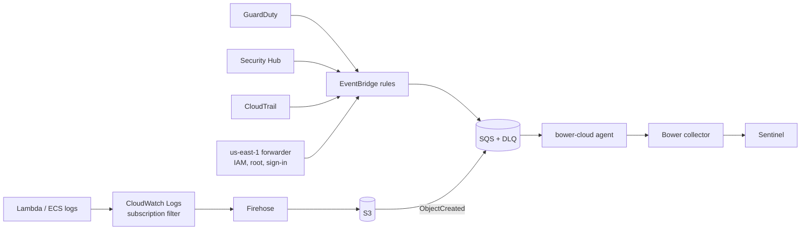

# AWS security signal

Bower forwards a small set of high-value AWS security events to Sentinel:
GuardDuty and Security Hub findings, CloudTrail events that change who can do what
or switch off detection, and Bower events that Lambda or ECS applications write to
CloudWatch Logs. It does not ship CloudTrail wholesale.



| Step | Where it happens |
|---|---|
| Collect | EventBridge rules and an optional CloudWatch Logs subscription |
| Select | Rule patterns (which API calls, severities) and the `aws-security` pack policies |
| Arrange | The agent maps events to Bower envelopes; the collector redacts and validates |
| Deliver | Collector queue to the Logs Ingestion API or AMA |
| Prove | `bower evidence run` as for any other source |

## What is forwarded

| Rule | Pattern |
|---|---|
| GuardDuty | `GuardDuty Finding` with severity 4.0 (Medium) or higher |
| Security Hub | `Security Hub Findings - Imported`, HIGH or CRITICAL, workflow NEW, record ACTIVE |
| IAM changes | users, access keys, login profiles, policy attachment and versions, roles and trust policies, MFA removal, SAML and OIDC providers |
| Control tampering | CloudTrail stop/delete/update, GuardDuty detector removal, Config recorder stop, KMS key disable or deletion, Security Hub disable, S3 public access and bucket policy changes, snapshot sharing, security group ingress, leaving the organisation |
| Console sign-in | failed sign-ins |
| Root | any API call or console sign-in by the root user |

IAM, root and many sign-in events are emitted only in `us-east-1`. The forwarder
stack sends them to your home region's default event bus, where the same rules
select them. Events are not stored in `us-east-1`; they originate there.

EventBridge only receives CloudTrail management events when a trail with logging
enabled exists in the account (an organisation trail is fine).

## Events

| `eventType` | `eventCategory` | `eventAction` | `eventResult` | Actor | Target |
|---|---|---|---|---|---|
| `aws_cloudtrail` | `administrative-activity`, or `authentication` for `ConsoleLogin` | CloudTrail `eventName` | `failure` with `errorCode`, `denied` for AccessDenied/Unauthorized, `failure` for a failed console sign-in, else `success` | `username` = IAM user, assumed role name or `root`; `userId` = principal ARN | `aws-api`, the service endpoint |
| `aws_guardduty` | `application-security` | finding `type` | `failure` | — | `finding`, the finding type |
| `aws_security_hub` | `application-security` | finding `Title` | `failure` when compliance FAILED | — | `finding`, the product ARN |

Event ids are `aws-` plus a hash of source, kind, record id and time, so a message
delivered twice becomes one queued event. Labels carry `aws.accountId`,
`aws.region`, `aws.eventName`, `aws.identityType`, `aws.mfaUsed`, `aws.findingType`
and similar fields for detections. The original record is **not** copied into the
event unless `BOWER_INCLUDE_RAW_RECORDS=true`; CloudTrail request parameters can
hold sensitive values. Long titles are cut to the schema limits on the host.

Application events from CloudWatch Logs are forwarded only when a log line is a
Bower envelope (plain JSON, a Lambda JSON log whose `message` is the envelope, or
text followed by the envelope). Every other line is dropped by the agent.

## Deploy

All templates start with **rules disabled** (`RuleState=DISABLED`). Validate the
agent and collector first, then update the stacks with `RuleState=ENABLED`.

```bash
# Home region (Sydney or Melbourne; the template refuses other regions by default)
aws cloudformation deploy --region ap-southeast-2 \
  --template-file deploy/aws/bower-aws-security.yaml \
  --stack-name bower-aws-security \
  --capabilities CAPABILITY_IAM \
  --parameter-overrides AppLogBucketName=acme-bower-app-logs AppLogGroupName=/aws/lambda/orders

# Global services, in us-east-1
aws cloudformation deploy --region us-east-1 \
  --template-file deploy/aws/bower-aws-global-forwarder.yaml \
  --stack-name bower-aws-global-forwarder \
  --capabilities CAPABILITY_IAM \
  --parameter-overrides HomeEventBusArn=arn:aws:events:ap-southeast-2:123456789012:event-bus/default
```

The home stack creates:

- an SQS queue with SQS-managed encryption, 20-second long polling, a 5-minute
  visibility timeout and a dead-letter queue after `MaxReceiveCount` (10) deliveries;
- a queue policy that only accepts the stack's rules (and the app log bucket), and
  denies non-TLS access;
- `ConsumerPolicy`, a managed policy with `ReceiveMessage`, `DeleteMessage`,
  `ChangeMessageVisibility` and `GetQueueAttributes` on the queue and `GetObject`
  on the app log bucket. Attach it to the agent's role.
- optionally, an encrypted, private app log bucket with lifecycle expiry, a Firehose
  stream and a subscription filter that only sends lines containing `schemaVersion`.

For multiple accounts, deploy the stacks in each account, or send events from member
accounts to one security account's event bus and deploy the queue there.

## Run the agent

The agent is the `bower-cloud` image (`Bower.Agent.Cloud`). Run it where it can reach
your collector: an EC2 instance next to the collector, ECS, or EKS.

```bash
docker compose -f deploy/docker/compose.cloud.yaml up -d
```

| Variable | Default | Purpose |
|---|---|---|
| `BOWER_AWS_SQS_QUEUE_URL` | — | `QueueUrl` stack output. Region and account are read from it. |
| `BOWER_AWS_REGION` / `BOWER_AWS_ACCOUNT_ID` | from the URL | Needed for VPC endpoint URLs. |
| `BOWER_AWS_S3_BUCKETS` | — | Comma-separated buckets whose notifications may be read. Others are ignored. |
| `BOWER_AWS_S3_MAX_OBJECT_MB` | `32` | Larger objects are dead-lettered. Decompressed size is capped at 64 MiB. |
| `BOWER_REQUIRE_AU_REGION` | `false` | `true` refuses a queue outside `ap-southeast-2` / `ap-southeast-4`. Otherwise a warning is logged. |
| `BOWER_AWS_ALLOW_STATIC_KEYS` | `false` | Long-lived `AWS_ACCESS_KEY_ID` without a session token is refused unless this is set (labs only). |
| `BOWER_COLLECTOR_URL`, `BOWER_INGEST_TOKEN(_FILE)` | — | As for the sidecar; HTTPS unless loopback or a single-label service name. |
| `BOWER_BATCH_SIZE` | `10` | Messages per receive. |
| `BOWER_RETRY_SECONDS` | `60` | How long a message stays hidden after backpressure. |
| `BOWER_INCLUDE_RAW_RECORDS` | `false` | Copy original records into `attributes`. |

Credentials come from the AWS default chain: an EC2 instance profile (set the IMDSv2
hop limit to 2 for containers), an ECS task role, or an EKS IRSA role. No keys are
stored in Bower.

## Delivery guarantees

- A message is deleted only after every event in it was accepted (2xx) or
  definitively rejected by policy (400/413/422).
- Collector backpressure (503, 5xx, 401/403, network errors) releases the message
  with `BOWER_RETRY_SECONDS` visibility; a 429 is retried in place.
- Before each receive the agent probes the collector's `/health`. While the collector
  is unreachable it does not receive, so an outage does not spend delivery attempts
  and push healthy messages into the dead-letter queue.
- Malformed messages are made visible again immediately so SQS moves them to the
  dead-letter queue after `MaxReceiveCount`. Inspect them there and use SQS
  dead-letter queue redrive after fixing the cause.
- Messages the agent does not understand (another `detail-type`, an S3 test event,
  a bucket that is not allowed) are deleted and counted as unsupported: default deny.
- Redelivered messages produce the same event ids and the collector deduplicates them.

The agent logs message ids, counts and failure types only, never bodies.

## Pack

Build and load the `aws-security` pack in the collector:

```bash
bower pack build packs/aws-security --key bower-signing.key.pem --out packs-out
# collector
BOWER_PACKS=packs-out/aws-security-1.0.0.bowerpack BOWER_PACK_TRUSTED_KEYS=bower-signing.pub.pem
```

It holds two policies (`BWR-PACK-AWS-CLOUDTRAIL`, `BWR-PACK-AWS-FINDINGS`), Sigma
detections for root activity, logging and key tampering, access key creation and
console sign-in failures, and samples that must pass before the pack can be signed.
It ships no privacy profile so it can be loaded next to other packs. To pseudonymise
principals, set `BOWER_PRIVACY_PROFILE=deploy/privacy/cloud-identities.yaml` with an
HMAC key; by default email addresses are masked and secrets redacted.

## Limits

- The CloudFormation templates are validated with `ValidateTemplate`, `cfn-lint` and
  EventBridge `TestEventPattern` against the test fixtures; they have not been
  deployed by the Bower test suite.
- Security Hub's OCSF `Findings Imported V2` events are not mapped yet and are dropped.
- VPC flow logs and Route 53 resolver logs are parsed by `Bower.Source.Aws` but not
  forwarded by the agent; they are high-volume network telemetry, not semantic events.
