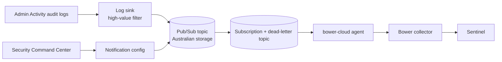

# Google Cloud security signal

Bower forwards Security Command Center findings and high-value Cloud Audit Logs to
Sentinel through one Pub/Sub subscription. It does not ship Cloud Logging wholesale.



## What is forwarded

| Source | Selection |
|---|---|
| Cloud Audit Logs | Admin Activity entries whose method matches `audit_methods` (IAM policy changes, service account and key creation, custom roles, log sinks, buckets and exclusions, org policy, SCC notification changes, firewall changes, KMS key destruction, Workload Identity providers), plus any admin call denied with `PERMISSION_DENIED` |
| Security Command Center | `state = "ACTIVE" AND mute != "MUTED" AND (severity = "HIGH" OR severity = "CRITICAL")` |

With `organization_id` set the sink covers the whole organisation and the SCC
notification config is created. Without it, a project sink is created and SCC is
skipped.

## Events

| `eventType` | `eventCategory` | `eventAction` | `eventResult` | Actor | Target |
|---|---|---|---|---|---|
| `gcp_cloud_audit` | `administrative-activity` | `protoPayload.methodName` | `success` for status 0, `denied` for 7 or 16, else `failure` | `principalEmail` (service accounts typed `service`) | `resource.type`, `resourceName` |
| `gcp_scc_finding` | `application-security` | finding `category` | `failure` while ACTIVE, else `success` | — | resource type and name |

`source.ipAddress` is set only when `callerIp` is an address; values such as
`private` or `gce-internal-ip` go to the `gcp.callerIp` label. Labels carry
`gcp.projectId`, `gcp.service`, `gcp.method`, `gcp.auditLog`, `gcp.findingClass`,
`gcp.state` and similar fields. SCC severity maps to the Bower severity. A finding
that changes state is a new event; the same notification delivered twice is not.
Raw entries are not copied into events unless `BOWER_INCLUDE_RAW_RECORDS=true`.

## Deploy

```bash
cd deploy/gcp
cp terraform.tfvars.example terraform.tfvars   # set project, organisation and the agent identity
terraform init
terraform plan -out bower.plan
terraform apply bower.plan
```

The module creates:

- a topic and dead-letter topic whose **message storage policy** allows only
  `australia-southeast1` and `australia-southeast2`, with in-transit enforcement;
- a pull subscription (60 s ack deadline, 7-day retention, exponential retry,
  dead-lettering after `max_delivery_attempts` = 10) and a dead-letter subscription
  to inspect and replay messages;
- the log sink and SCC notification config, each with publisher rights on the topic
  only;
- `roles/pubsub.subscriber` on the subscription for `subscriber_member`;
- optionally a Workload Identity Federation pool for an agent that runs in AWS, so
  the same agent can read both clouds with its AWS role and no Google key.

Set `BOWER_GCP_PUBSUB_ENDPOINT=https://australia-southeast1-pubsub.googleapis.com/`
to use the Australian locational endpoint.

## Run the agent

| Variable | Default | Purpose |
|---|---|---|
| `BOWER_GCP_SUBSCRIPTION` | — | `subscription` Terraform output (`projects/…/subscriptions/…`). |
| `BOWER_GCP_PUBSUB_ENDPOINT` | `https://pubsub.googleapis.com/` | HTTPS only. |
| `GOOGLE_APPLICATION_CREDENTIALS` | — | Only for Workload Identity Federation: the `external_account` file from `aws_credential_config_command`. It holds no secret. |
| `BOWER_GCP_ALLOW_KEY_FILE` | `false` | Service account key files are refused unless this is set (labs only). |

Other variables (`BOWER_COLLECTOR_URL`, `BOWER_INGEST_TOKEN`, `BOWER_BATCH_SIZE`,
`BOWER_RETRY_SECONDS`, `BOWER_INCLUDE_RAW_RECORDS`) are shared with the AWS source;
see [AWS](aws.md#run-the-agent).

Credentials come from Application Default Credentials: GKE Workload Identity, the
service account attached to Cloud Run or Compute Engine, or Workload Identity
Federation.

## Delivery guarantees

- A message is acknowledged only after its event was accepted or rejected by policy.
- Backpressure sets the ack deadline to `BOWER_RETRY_SECONDS`; Pub/Sub redelivers
  afterwards. The agent does not pull while the collector is unreachable.
- Malformed messages get a zero ack deadline, so Pub/Sub retries them and moves them
  to the dead-letter topic after `max_delivery_attempts`.
- Unsupported payloads (other log types) are acknowledged and dropped: default deny.

## Pack

`packs/gcp-security` holds `BWR-PACK-GCP-AUDIT` and `BWR-PACK-GCP-SCC`, Sigma
detections for service account key creation, IAM policy changes, logging tampering
and denied admin calls, and samples. Build, sign and load it like the AWS pack. Both
cloud packs can be loaded together; use
`deploy/privacy/cloud-identities.yaml` to pseudonymise principal emails with HMAC.

## Limits

- The Terraform module passes `terraform validate`; it has not been applied by the
  Bower test suite.
- Data Access audit logs are not selected by default (high volume). Add a filter
  clause if a specific service needs them.
- The agent cannot read the topic's storage policy with subscriber rights, so it logs
  a reminder at start-up instead of checking it.
